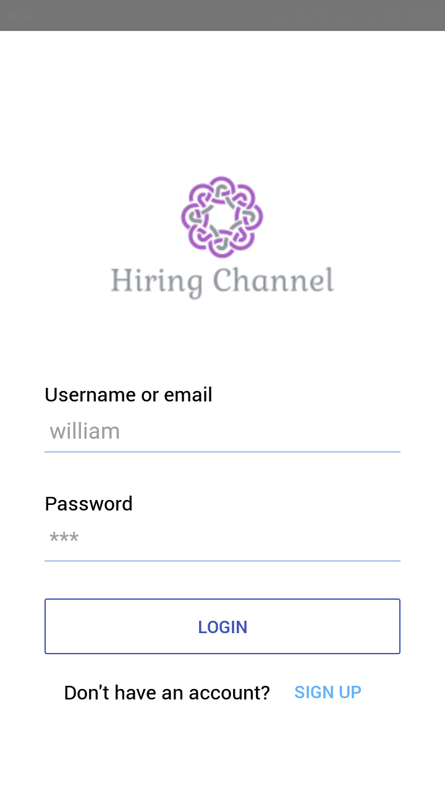

<h1 align="center">Hiring Channel</h1>
<p align="center">
  
</p>
<p align="center">
  Built with React Native
</p>

## Introduction

<b>Hiring Channel</b> is mobile applications where Engineer and Company can communicate for looking/hiring jobs.

## Built With
* [React Native](https://facebook.github.io/react-native/)

## Features
* Sign Up as engineer or company
* Company profile and engineer profile
* Company can see engineer list, skills and expected salary
* Company can send message from email
* And others

## Requirements
* [Node.js](https://nodejs.org/en/)
* [Yarn](https://yarnpkg.com/lang/en/)
* [React Native](https://facebook.github.io/react-native/)

## Installation

Clone this repository and then use the package manager yarn to install dependencies.

```bash
yarn
```

## Run the app

Prepare your android device or emulator, if you're new in react native you can start with this [documentation](https://facebook.github.io/react-native/docs/getting-started)

```bash
yarn run android
```

## Setup Environment Variable

Create .env file in your root project folder.

```
# Set API Endpoint
API_BASE_URL=https://hiring-channel-api.herokuapp.com/
API_ENDPOINT=https://hiring-channel-api.herokuapp.com/api/v1/
API_ENGINEER_ENDPOINT=https://hiring-channel-api.herokuapp.com/api/v1/engineers
API_COMPANY_ENDPOINT=https://hiring-channel-api.herokuapp.com/api/v1/companies
```

## Screenshots

<div align="center">
       
    
    
</div>
<div align="center">  
       
    
    
</div>

## Release APK
<a href="https://drive.google.com/file/d/1TsV7oFRQT9rwUf5GnfUkMLV0Fp7s5r44/view?usp=sharing">
  
</a>

## Related Project (API)
* [Hiring Channel API](https://github.com/vengeansce/hiring-channel-api/)

## Contributing
Pull requests are welcome. For major changes, please open an issue first to discuss what you would like to change.

Please make sure to update tests as appropriate.

## License
[MIT](https://choosealicense.com/licenses/mit/)
